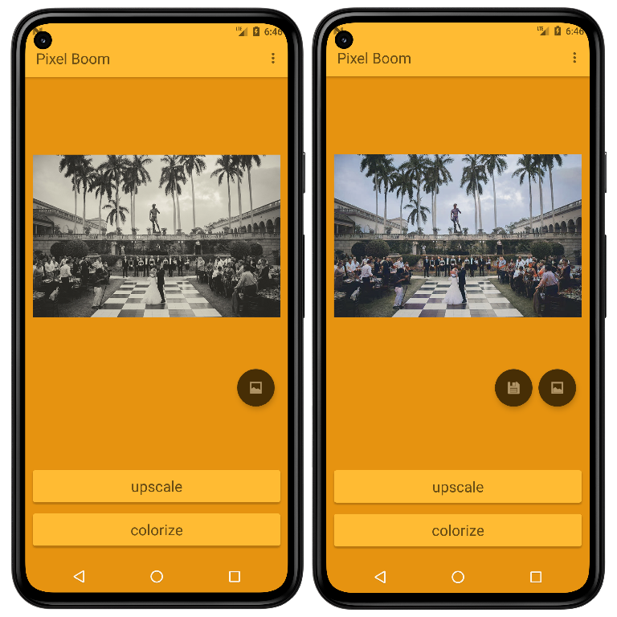
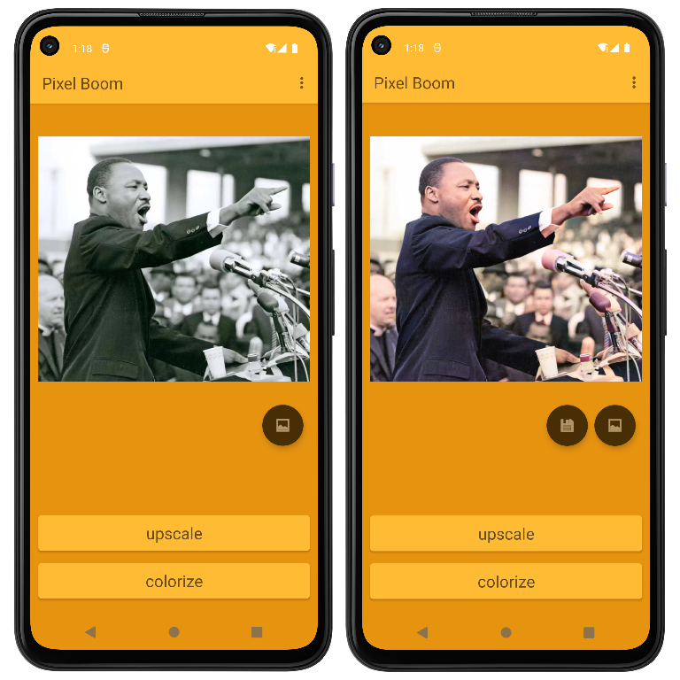

# Pixel Boom

Pixel Boom is a Java-based Android app, featuring image super-resolution and colorization.

 

	
Screenshots

	
	

## Usage

0. Download the APK from our latest release
1. Install Pixel Boom
2. Start the software and grant permission requested
3. Select a picture form album by pressing the album icon on the right
4. Press "upscale" to try super-resolution, or
5. Press "colorize" to try colorization
6. Wait for processing, until the processed image appears in the center image view
7. Press and hold the image to compare with the original
8. Press the save icon to save the image into your album
9. Find "Menu-About" in the top right corner to view the intro

## Environment Requirement

Minimum Android version: 7.0 (API Level 24)

## Development Team

- Zhang Zeyu [*@JerryZhangZZY*](https://github.com/JerryZhangZZY)
- Wang Zaitian [*@ZaitianWang*](https://github.com/ZaitianWang)

## Acknowledgement

The project is powered by **DeepAI**, especially [Super Resolution API](https://deepai.org/machine-learning-model/torch-srgan) and [Image Colorization API](https://deepai.org/machine-learning-model/colorizer).
